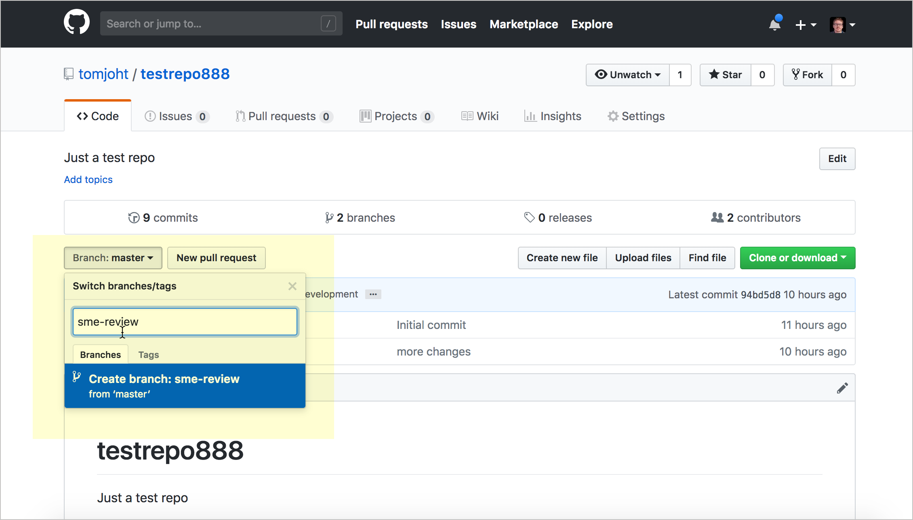

# Инструкция по работе с git

## Что это и для чего нужна система контроля версий?
Программное обеспечение контроля версий отслеживает все вносимые в код изменения в специальной базе данных. При обнаружении ошибки разработчики могут вернуться назад и выполнить сравнение с более ранними версиями кода для исправления ошибок, сводя к минимуму проблемы для всех участников команды.

blablabla

### Что такое система контроля версий?
Программное обеспечение для облегчения работы с изменяющейся информацией. Система управления версиями позволяет хранить несколько версий одного и того же документа, при необходимости возвращаться к более ранним версиям, определять, кто и когда сделал то или иное изменение, и многое другое.
### Для чего нужна система контроля версий
Системы контроля версий — это программные инструменты, помогающие командам разработчиков управлять изменениями в исходном коде с течением времени. В свете усложнения сред разработки они помогают командам разработчиков работать быстрее и эффективнее. Системы контроля версий наиболее полезны командам DevOps, поскольку помогают сократить время разработки и увеличить количество успешных развертываний.
## Установка git и VSCode на ваш ПК.

### Установка VSCode на ваш ПК.
(Чтобы заполучить себе на компьютер VSCode перейдите на сайт https://code.visualstudio.com/docs/setup/setup-overview
и скачайте его оттуда :-).
### Установка git на ваш ПК
Чтобы установить Git на Windows, вам нужно скачать установщик с сайта Git

#### Первая настройка git
Еще добавил комментарий.

## Создание и базовая работа с локальным репозиторием.

### Что такое репозиторий и инструкция по созданию локальных репозиториев.
Обычно вы получаете репозиторий Git одним из двух способов: Вы можете взять локальный каталог, который в настоящее время не находится под версионным контролем, и превратить его в репозиторий Git, либо. Вы можете клонировать существующий репозиторий Git из любого места. В обоих случаях вы получите готовый к работе Git репозиторий на вашем компьютере.
### Базовая работа с локальным репозиторием
git fetch и git pull — забираем изменения из центрального репозитория. Для синхронизации текущей ветки с репозиторием используются команды git fetch и git pull. git fetch — забирает изменения удаленной ветки из репозитория по умолчания, основной ветки; той, которая была использована при клонировании репозитория.
## Ветки. Локальная работа с ветками в git.

### Что такое ветки и для чего они нужны при работе с системой контроля версий.
По мере своего становления в роли разработчика приходит понимание того, что большая часть работы ведется в команде. И при работе в команде нужна система контроля версий, которая поможет управлять изменениями в коде, сделанными разными разработчиками.

### Базовая работа с ветками в git.
Git clone
Всегда клонируйте новые репозитории, над которыми работаете. То есть, закачивайте копии файлов репозитория на свой локальный компьютер. Существует множество способов клонирования репозитория. Однако я объясню технологию на примере командной строки.

Допустим, вы захотели клонировать репозиторий. Для начала скопируйте ссылку клонирования. Затем откройте терминал и через cd перейдите в область на компьютере, куда будут копироваться файлы. Если вы хотите клонировать ветку master, то напечатайте git clone и вставьте ссылку, как это показано ниже:

git clone https://github.com/JamesOkunlade/old-apple.git

Для клонирования определенной ветки репозитория сделайте следующее:

git clone https://github.com/JamesOkunlade/old-apple.git -b branch-name

Git checkout
Лучше всего не работать напрямую в master, а создавать отдельные ветки под разные опции. Как только вы решите, что все фичи соответствуют требованиям и готовы к тестированию, смело сливайте их с веткой master.

В процессе работы возникает необходимость перехода в отдельную ветку репозитория. Это можно сделать следующей командой.

Если ветка уже создана:

git checkout branch-name

Если вы создаете новую ветку опций:

git checkout -b branch-name

Git pull
Ваша команда или коллега-разработчик могут изменять ветки репозитория. И каждый раз перед написанием кода вы должны вливать эти изменения в ветку, с которой будете работать. Перейдите в ветку через checkout и выполните команду git pull. Последние изменения будут влиты в локальный репозиторий.

Git add и commit
Команды add и commit почти всегда неразлучны. Это как захват и сохранение данных. Вы не сможете ничего сохранить, пока не захватите нужные данные. Таким образом, команда add всегда предшествуетcommit. С командой add вы указываете определенный файл, который требуется захватить в текущем состоянии, а commitсохраняет его копию.

Для захвата всех файлов (кроме исключений изgit ignore) понадобится git add. Захват текущего состояния отдельно взятого файла (к примеру, index.html) делается через git add index.html.

После создания снимков репозитория их нужно закоммитить и сохранить в локальный репозиторий. Это делается через следующую команду:

git commit -m ‘commit message’

Сообщение в коммите должно пояснить специфику сохраняемых снимков. Например:

git add index.html

git commit -m ‘создание кнопки формы опции’

Две команды можно объединить через оператор&&:

git add index.html && git commit -m ‘создание html структуры футера’

Git stash и merge
git stash сохранит все изменения ветки, которые вы не хотите коммитить. Это значит, что вы можете ждать, пока другой разработчик закоммитит и вольет копию своих изменений в ветку, и параллельно экспериментировать с той же веткой. Git всячески это приветствует. Если вы хотите просто влить новые изменения в локальный репозиторий, но не выполнять слияния с веткой, то просто сохраните эти изменения черезstash. git stash сохранит копию этих изменений. Их можно будет просмотреть через список git stash.

git merge – это команда, которая сливает два разных снимка репозитория. Вы можете сливать разные снимки изменений одной и той же ветви, сделанные разными разработчиками. Либо же можно сливать разные снимки разных веток.

При переходе в ветку master команда git merge сливает ветку dev с master и наоборот.

Git push
По аналогии с тем, как вы сохраняете снимки в Google Фото, и их видят другие люди, имеющие доступ, git push отправляет локальный репозиторий на сервер, доступный другим пользователям.

git push -u origin branch-name
## Работа с удаленными репозиториями.

### Что такое удаленный репозиторий и для чего он нужен
Удаленный репозиторий – это репозиторий, размещенный в локальной или интернет сети. Удаленный репозиторий используется для того, чтобы делиться и обмениваться кодом между разработчиками в рамках сети. Его также можно использовать, если вы разрабатываете проект на нескольких устройствах.
### Базовая работа с удаленными репозиториями GitHub

котики лучшие создания в мире.

Просмотр удалённых репозиториев
Для того, чтобы просмотреть список настроенных удалённых репозиториев, вы можете запустить команду git remote. Она выведет названия доступных удалённых репозиториев. Если вы клонировали репозиторий, то увидите как минимум origin — имя по умолчанию, которое Git даёт серверу, с которого производилось клонирование:

$ git clone https://github.com/schacon/ticgit
Cloning into 'ticgit'...
remote: Reusing existing pack: 1857, done.
remote: Total 1857 (delta 0), reused 0 (delta 0)
Receiving objects: 100% (1857/1857), 374.35 KiB | 268.00 KiB/s, done.
Resolving deltas: 100% (772/772), done.
Checking connectivity... done.
$ cd ticgit
$ git remote
origin
Вы можете также указать ключ -v, чтобы просмотреть адреса для чтения и записи, привязанные к репозиторию:

$ git remote -v
origin	https://github.com/schacon/ticgit (fetch)
origin	https://github.com/schacon/ticgit (push)
Если у вас больше одного удалённого репозитория, команда выведет их все. Например, для репозитория с несколькими настроенными удалёнными репозиториями в случае совместной работы нескольких пользователей, вывод команды может выглядеть примерно так:

$ cd grit
$ git remote -v
bakkdoor  https://github.com/bakkdoor/grit (fetch)
bakkdoor  https://github.com/bakkdoor/grit (push)
cho45     https://github.com/cho45/grit (fetch)
cho45     https://github.com/cho45/grit (push)
defunkt   https://github.com/defunkt/grit (fetch)
defunkt   https://github.com/defunkt/grit (push)
koke      git://github.com/koke/grit.git (fetch)
koke      git://github.com/koke/grit.git (push)
origin    git@github.com:mojombo/grit.git (fetch)
origin    git@github.com:mojombo/grit.git (push)
Это означает, что мы можем легко получить изменения от любого из этих пользователей. Возможно, что некоторые из репозиториев доступны для записи и в них можно отправлять свои изменения, хотя вывод команды не даёт никакой информации о правах доступа.

Обратите внимание на разнообразие протоколов, используемых при указании адреса удалённого репозитория; подробнее мы рассмотрим протоколы в разделе Установка Git на сервер главы 4.

Добавление удалённых репозиториев
В предыдущих разделах мы уже упоминали и приводили примеры добавления удалённых репозиториев, сейчас рассмотрим эту операцию подробнее. Для того, чтобы добавить удалённый репозиторий и присвоить ему имя (shortname), просто выполните команду git remote add <shortname> <url>:

$ git remote
origin
$ git remote add pb https://github.com/paulboone/ticgit
$ git remote -v
origin	https://github.com/schacon/ticgit (fetch)
origin	https://github.com/schacon/ticgit (push)
pb	https://github.com/paulboone/ticgit (fetch)
pb	https://github.com/paulboone/ticgit (push)
Теперь вместо указания полного пути вы можете использовать pb. Например, если вы хотите получить изменения, которые есть у Пола, но нету у вас, вы можете выполнить команду git fetch pb:

$ git fetch pb
remote: Counting objects: 43, done.
remote: Compressing objects: 100% (36/36), done.
remote: Total 43 (delta 10), reused 31 (delta 5)
Unpacking objects: 100% (43/43), done.
From https://github.com/paulboone/ticgit
 * [new branch]      master     -> pb/master
 * [new branch]      ticgit     -> pb/ticgit
Ветка master из репозитория Пола сейчас доступна вам под именем pb/master. Вы можете слить её с одной из ваших веток или переключить на неё локальную ветку, чтобы просмотреть содержимое ветки Пола. Более подробно работа с ветками рассмотрена в главе Ветвление в Git.

Получение изменений из удалённого репозитория — Fetch и Pull
Как вы только что узнали, для получения данных из удалённых проектов, следует выполнить:

$ git fetch [remote-name]
Данная команда связывается с указанным удалённым проектом и забирает все те данные проекта, которых у вас ещё нет. После того как вы выполнили команду, у вас должны появиться ссылки на все ветки из этого удалённого проекта, которые вы можете просмотреть или слить в любой момент.

Когда вы клонируете репозиторий, команда clone автоматически добавляет этот удалённый репозиторий под именем «origin». Таким образом, git fetch origin извлекает все наработки, отправленные на этот сервер после того, как вы его клонировали (или получили изменения с помощью fetch). Важно отметить, что команда git fetch забирает данные в ваш локальный репозиторий, но не сливает их с какими-либо вашими наработками и не модифицирует то, над чем вы работаете в данный момент. Вам необходимо вручную слить эти данные с вашими, когда вы будете готовы.

Если ветка настроена на отслеживание удалённой ветки (см. следующий раздел и главу Ветвление в Git чтобы получить больше информации), то вы можете использовать команду git pull чтобы автоматически получить изменения из удалённой ветки и слить их со своей текущей. Этот способ может для вас оказаться более простым или более удобным. К тому же, по умолчанию команда git clone автоматически настраивает вашу локальную ветку master на отслеживание удалённой ветки master на сервере, с которого вы клонировали репозиторий. Название веток может быть другим и зависит от ветки по умолчанию на сервере. Выполнение git pull, как правило, извлекает (fetch) данные с сервера, с которого вы изначально клонировали, и автоматически пытается слить (merge) их с кодом, над которым вы в данный момент работаете.

Примечание
Начиная с версии 2.27, команда git pull выдаёт предупреждение, если настройка pull.rebase не установлена. Git будет выводить это предупреждение каждый раз пока настройка не будет установлена.

Если хотите использовать поведение Git по умолчанию (простое смещение вперёд если возможно — иначе создание коммита слияния): git config --global pull.rebase "false"

Если хотите использовать перебазирование при получении изменений: git config --global pull.rebase "true"

Отправка изменений в удалённый репозиторий (Push)
Когда вы хотите поделиться своими наработками, вам необходимо отправить их в удалённый репозиторий. Команда для этого действия простая: git push <remote-name> <branch-name>. Чтобы отправить вашу ветку master на сервер origin (повторимся, что клонирование обычно настраивает оба этих имени автоматически), вы можете выполнить следующую команду для отправки ваших коммитов:

$ git push origin master
Эта команда срабатывает только в случае, если вы клонировали с сервера, на котором у вас есть права на запись, и если никто другой с тех пор не выполнял команду push. Если вы и кто-то ещё одновременно клонируете, затем он выполняет команду push, а после него выполнить команду push попытаетесь вы, то ваш push точно будет отклонён. Вам придётся сначала получить изменения и объединить их с вашими и только после этого вам будет позволено выполнить push. Обратитесь к главе Ветвление в Git для более подробного описания, как отправлять изменения на удалённый сервер.

Просмотр удалённого репозитория
Если хотите получить побольше информации об одном из удалённых репозиториев, вы можете использовать команду git remote show <remote>. Выполнив эту команду с некоторым именем, например, origin, вы получите следующий результат:

$ git remote show origin
* remote origin
  Fetch URL: https://github.com/schacon/ticgit
  Push  URL: https://github.com/schacon/ticgit
  HEAD branch: master
  Remote branches:
    master                               tracked
    dev-branch                           tracked
  Local branch configured for 'git pull':
    master merges with remote master
  Local ref configured for 'git push':
    master pushes to master (up to date)
Она выдаёт URL удалённого репозитория, а также информацию об отслеживаемых ветках. Эта команда любезно сообщает вам, что если вы, находясь на ветке master, выполните git pull, ветка master с удалённого сервера будет автоматически влита в вашу сразу после получения всех необходимых данных. Она также выдаёт список всех полученных ею ссылок.

Это был пример для простой ситуации и вы наверняка встречались с чем-то подобным. Однако, если вы используете Git более интенсивно, вы можете увидеть гораздо большее количество информации от git remote show:

$ git remote show origin
* remote origin
  URL: https://github.com/my-org/complex-project
  Fetch URL: https://github.com/my-org/complex-project
  Push  URL: https://github.com/my-org/complex-project
  HEAD branch: master
  Remote branches:
    master                           tracked
    dev-branch                       tracked
    markdown-strip                   tracked
    issue-43                         new (next fetch will store in remotes/origin)
    issue-45                         new (next fetch will store in remotes/origin)
    refs/remotes/origin/issue-11     stale (use 'git remote prune' to remove)
  Local branches configured for 'git pull':
    dev-branch merges with remote dev-branch
    master     merges with remote master
  Local refs configured for 'git push':
    dev-branch                     pushes to dev-branch                     (up to date)
    markdown-strip                 pushes to markdown-strip                 (up to date)
    master                         pushes to master                         (up to date)
Данная команда показывает какая именно локальная ветка будет отправлена на удалённый сервер по умолчанию при выполнении git push. Она также показывает, каких веток с удалённого сервера у вас ещё нет, какие ветки всё ещё есть у вас, но уже удалены на сервере, и для нескольких веток показано, какие удалённые ветки будут в них влиты при выполнении git pull.

Удаление и переименование удалённых репозиториев
Для переименования удалённого репозитория можно выполнить git remote rename. Например, если вы хотите переименовать pb в paul, вы можете это сделать при помощи git remote rename:

$ git remote rename pb paul
$ git remote
origin
paul
Стоит упомянуть, что это также изменит имена удалённых веток в вашем репозитории. То, к чему вы обращались как pb/master, теперь стало paul/master.

Если по какой-то причине вы хотите удалить удалённый репозиторий — вы сменили сервер или больше не используете определённое зеркало, или кто-то перестал вносить изменения — вы можете использовать git remote rm:

$ git remote remove paul
$ git remote
origin
При удалении ссылки на удалённый репозиторий все отслеживаемые ветки и настройки, связанные с этим репозиторием, так же будут удалены.

## Совместная работа над проектом (fork, pull request)

### Как строится и для чего нужна совместная работа в системах контроля версий
Взаимодействие просто представляет собой синхронизацию локального и удаленного репозиториев. Копирование данных из локального репозитория в удаленный в данной системе контроля версий осуществляется командой push, а обратный процесс – командой pull. Любые изменения в документе и его новые версии сохраняются в локальном репозитории. Набор всех сохраненных версий называют «деревом» проекта, и оно находится в репозитории.
Работа в системе контроля версий дает возможность сохранять промежуточные варианты проекта, плюс это еще и помогает справляться с проблемами в случае их возникновения. Когда, например, несколько программистов, работающих над одной опцией, одновременно сбросят в репозиторий созданные версии, то система в автоматическом режиме займется устранением конфликта.
### Инструкция по созданию pull request
Создание изменение в отдельной ветке
По умолчанию в новом репозитории есть одна ветка с именем «Master». Обычно, когда при внесении изменений или просмотра / редактировании, создается новая ветка и вносятся все изменения в ветку. Затем, по окончании, владелец репо объединяет изменения из новой ветки в «Master» через «pull request».

 Note: Можно выполнять эти операции, используя команды Git в терминале, а также Можно выполнять их в интерфейсе браузера. Интерфейс браузера может быть полезен, если людей, вносящих изменения в ваш контент.
Для создания изменений в отдельной ветке:

Со стороны рецензента переходим к тому же репозиторию GitHub, который был создан на предыдущем занятии (можно создать новый репо). Создаем новую ветку, выбрав раскрывающееся меню ветки и введя имя новой ветки, например «sme-review». Затем Enter.

При создании новой ветки, содержимое из главной (или любой другой ветки, которая сейчас просматривается) копируется в новую ветку. Процесс похож на «Сохранить как» с существующим документом.

Кликаем в область ввода текста, а затем кликаем по иконке карандаша («Edit this file»), чтобы отредактировать файл.

Вносим изменения в контент и прокручиваем вниз экрана до области Commit changes. Поясняем причину изменений и подтверждаем изменения в своей ветке sme-review, нажав кнопку Commit changes.
Рецензенты могут продолжать вносить изменения таким образом, пока не закончат просмотр всей документации. Все изменения делаются в этой новой ветке, а не в мастере.

Создание Pull request
Теперь представим, что процесс проверки завершен, и пришло время объединить ветку с мастером. Ветка объединяется с “Master” через Pull request. Любой «соавтор» в команде с правами на запись может инициировать и завершить Pull request (добавлять соавторов можете в «Настройки»> «Соавторы)

Для создания Pull request:

Находим на экране вкладку “Pull request”.
Кликаем по кнопке New pull request.
Выбираем ветку (sme-review), которую хотим сравнить с веткой “Master”.

Когда мы сравниваем ветку с мастером, мы увидим список всех изменений. Мы можем просмотреть изменения в двух режимах просмотра: Unified или Split (это вкладки, показанные справа от содержимого). Unified показывает правки вместе в одной области содержимого, тогда как split показывает два файла рядом.

Кликаем на кнопку Create pull request.
Поясняем pull request и снова кликаем кнопку Create pull request.
Владелец репозитория увидит pull request и сможет принять меры для его объединения.

Процесс Pull request
Теперь посмотрим на процесс со стороны владельцем проекта, который получил новый Pull request. Владельцу нужно обработать Pull request и объединить ветку sme-review с “Master”.

Переходим на вкладку “Pull requests”, чтобы увидеть ожидающие запросы на извлечение.
Кликаем по запросу и смотрим изменения, выбрав вкладку Files changed.

Также стоит обратить внимание, что если запрос на извлечение выполняется для более старой версии мастера, где исходное содержимое мастера больше не существует или перемещено в другое место, процесс слияния будет более трудным для выполнения.

Переходим на вкладку “Conversation” и кликаем кнопку Merge pull request.
кликаем Confirm merge.
Ветка sme-review объединяется с мастером. Теперь “Master” и ветка sme-review совпадают (ветки “смержены”).

Кликаем кнопку Delete branch для удаления ветки sme-review.
Не обязательно удалять ветку сразу. Старые ветки всегда можете удалить , щелкнув ссылку на ветки при просмотре репозитория Github, а затем нажмите кнопку Delete (корзина) рядом с веткой.

Если посмотреть на список веток, то после удаления ветка sme-review больше не отображается.

Добавление участников в проект
Иногда необходимо добавлять соавторов в проект Github, чтобы они могли вносить изменения в ветку. Если другие участники проекта, не являясь соавторами, захотят внести изменения, они получат сообщение об ошибке. (Inviting collaborators to a personal repository)

Человек без прав на запись, может “форкнуть” (скопировать) репо, а не вносить изменения в ветку в том же проекте. Однако копирование проекта клонирует весь репозиторий, а не создает ветку в том же репозитории. Форк (копия) будет существовать в учетной записи пользователя GitHub. Можно объединить форкнутый репозиторий (это типичная модель для опен-сорс проектов со многими внешними участниками), но этот сценарий, вероятно, менее распространен для технических писателей, работающих с разработчиками в тех же проектах.

Для добавления соавторов в проект:

В репозитории проекта переходи на вкладку “Settings”.
Нажимаем на кнопку Collaborators в левой части.
Вводим имена пользователей Github тех, кому хотим дать доступ в области Collaborator.
Нажимаем на кнопку Add collaborator.
## Книги и полезные ссылки по изучению git.

ProGit;
Приложение книги Pro Git book;
Подробное введение в работу с Git;
Книга «Волшебство Git»;
Лаконичный гайд по работе с Git.

## Альтернативные системы контроля версий.
DVC

DVC, или Data Version Control, — это один из многих доступных инструментов с открытым исходным кодом, упрощающих работу с проектами Data Science и ML.

Используется подход Git'а в том смысле, что дает интерфейс командной строки, который настраивается в несколько простых шагов. DVC, как предполагает его название, фокусируется не только на версионировании данных. Инструмент помогает командам управлять конвейерами и моделями машинного обучения. В конце концов, DVC способствует согласованности вашей команды и воспроизводимости ваших моделей.

Преимущества

Лёгкий, исходники открыты, подходит для всех основных облачных платформ и типов хранилищ данных.
Гибкий, независимый от формата и фреймворка, лёгкий в применении.

Недостатки

Контроль версий DVC тесно связан с управлением конвейером. Это означает, что, если ваша команда уже применяет другой инструмент конвейера данных, будет дублирование.
DVC лёгкий, это означает, что вашей команде, возможно, придётся вручную разработать дополнительные функции.

Delta Lake

Delta Lake — это слой хранилища с открытым исходным кодом, помогающий улучшить состояние озёр данных. Это делается предоставлением транзакций ACID, версионированием данных, управлением метаданными и управлением версиями данных. Инструмент находится ближе к слою абстракции озёр данных, заполняя пробелы там, где большинство озёр данных ограничены.

Преимущества

Предлагает множество функций, которые могут не входить в вашу систему хранения данных, например ACID-транзакции или эффективное управление метаданными.
Снижает необходимость в ручном управлении версиями данных и ручном решении других связанных с данными вопросов, позволяя разработчикам сосредоточиться на построении продуктов поверх озёр данных.

Недостатки

Delta Lake часто бывает перегибом для большинства проектов: инструмент был разработан для работы со Spark на больших данных.
Требуется специальный формат данных, а это означает, что инструмент теряет в гибкости и зависим в отношении текущих форматов.
Основная задача инструмента — действовать в качестве скорее уровня абстракции данных, а это может быть не тем, что нужно вашей команде, и также может игнорировать разработчиков, которым нужно решение легче.

Git LFS

Git LFS — разработанное рядом разработчиков расширение Git'а с открытым исходным кодом. Это ПО предназначено для устранения больших файлов, которые могут быть добавлены в ваше хранилище (например фотографий и наборов данных) с помощью указателей. Указатели легче, они указывают на хранилище LFS. Таким образом, когда вы отправляете изменения из вашего репозитория в основной, обновление не занимает много времени или места. Это очень легковесный вариант для управления данными.

Преимущества

Легко интегрируется в рабочие процессы разработки большинства компаний.
Использует те же права доступа, что и репозиторий, поэтому нет необходимости в дополнительном управлении правами.

Недостатки

Git LFS для хранения ваших данных требует выделенных серверов. Это, в свою очередь, в конечном счёте приводит к тому, что ваши группы дата-сайентистов оказываются заблокированными, а также к увеличению объема инженерной работы.
Серверы Git LFS не предназначены для масштабирования в отличие от DVC, который хранит данные в более общем и легко масштабируемом хранилище объектов, например S3.
Очень специфичен и может потребовать использования ряда других инструментов для иных этапов рабочего процесса в Data Science.

Pachyderm

Pachyderm — одна из немногих платформ для сбора данных в этом списке. Цель Pachyderm — создать платформу, позволяющую легко воспроизводить результаты моделей ML, управляя всем рабочим процессом обработки данных. В этом отношении Pachyderm — Docker для данных.

Pachyderm использует контейнеры Docker для упаковки вашей среды выполнения. Это позволяет легко воспроизвести результат. Сочетание версионирования данных и Docker дает специалистам Data Science и командам DevOps легко развёртывать модели и обеспечивать их согласованность. Компания Pachyderm взяла на себя обязательства по Биллю о правах в Data Science, в котором изложены основные цели продукта: воспроизводимость, знание истории данных, сотрудничество, инкрементальность и автономия, а также абстрагирование инфраструктуры. Эти принципы определяют многие из особенностей продукта и позволяют командам воспользоваться преимуществ инструмента в полной мере.

Преимущества

Базируется на контейнерах, что делает ваши среды данных портативными и лёгкими в миграции на различных вендоров облачных услуг.
Надёжный, масштабируется от небольших до очень больших систем.

Недостатки

Кривая обучения круче из-за большого количества подвижных частей, таких как сервер Kubernetes, необходимый для управления бесплатной версией Pachyderm.
При наличии различных технических компонентов сложно будет интегрировать Pachyderm в уже существующую инфраструктуру.

Dolt

Dolt — уникальное решение для версионирования данных. В отличие от некоторых других представленных вариантов, которые просто содержат данные о версии, Dolt — это база данных SQL с версиями в стиле Git. Но в отличие от Git'а, где в центре файлы, у Dolt в центре  — таблицы. Это означает, что вы можете обновлять и изменять данные, не беспокоясь о потере изменений. Приложение ещё новое, в ближайшем будущем планируется сделать его на 100 % совместимым с Git и MySQL.

Преимущества

Инструмент лёгкий, и его код частично открыт.
SQL-интерфейс делает его доступнее для аналитиков данных в сравнении с более непонятными вариантами.

Недостатки

По сравнению с другими версиями баз данных Dolt — еще не зрелый продукт.
Dolt — это база данных, то есть вы должны перенести свои данные в Dolt, чтобы получить его преимущества.
Dolt создан для версионирования таблиц. Это означает, что он не охватывает другие типы данных (например изображения или текст в свободной форме).

LakeFS

LakeFS позволяет командам строить повторяющиеся, атомарные и версионированные операции с данными об озёрах. На сцене LakeFS новичок, но он наносит удар. Предоставляется Git-подобная модель ветвления и управления версиями, предназначенная для работы с вашим озером данных, и она масштабируется до петабайт данных.

Подобно Delta Lake, LakeFS обеспечивает соответствие ACID в ваших озёрах данных. Однако LakeFS поддерживает как AWS S3, так и Google Cloud Storage в качестве бэкендов, а это означает, что для использования всех преимуществ не требуется использовать Spark.

Преимущества

Предоставляет расширенные возможности, такие как ACID транзакции, для лёгкости использования облачного хранения данных (например S3 и GCS), и всё это вне зависимости от формата.
Легко масштабируется, поддерживая очень большие озёра данных. Способен предоставить контроль версий как для среды разработки, так и для производственной среды.

Недостатки

LakeFS — относительно новый продукт, поэтому по сравнению с другими решениями функции и документация могут меняться быстрее.
Ориентирован на версионирование данных, а это означает, что вам потребуется использовать ряд иных инструментов для других этапов рабочего процесса Data Science.

### Итак, какая система контроля версий подойдет для вашего проекта?

(Это на ваш выбор :-)

# Система одновременных версий (CVS)

CVS (англ. Concurrent Versions System — система одновременных версий) — централизованная система управления версиями, популярная в 1990-е — нач. 2000-х годов. Хранит историю изменений определённого набора файлов, как правило, исходного кода программного обеспечения, и облегчает совместную работу группы людей над одним проектом. Распространяется на условиях лицензии GNU GPL.

С конца 2000-х годов активная разработка системы прекращена (последняя версия выпущена в мае 2008 года), в исходный код вносятся только небольшие исправления. Считается устаревшей системой.

# Apache Subversion (SVN)

Subversion (также известная как «SVN») — свободная централизованная система управления версиями, официально выпущенная в 2004 году компанией CollabNet. С 2010 года Subversion является одним из проектов Apache Software Foundation и официально называется Apache Subversion (зарегистрированный товарный знак).

Цель проекта в начале разработки — заменить распространённую на тот момент систему Concurrent Versions System (CVS), которая на сегодняшний день считается морально устаревшей. Subversion обладает всеми основными функциями CVS и избавлена от ряда недостатков последней.